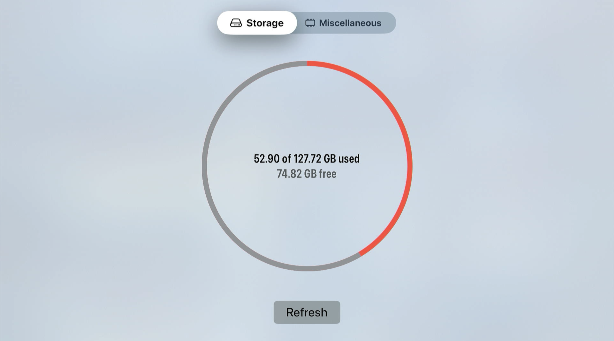
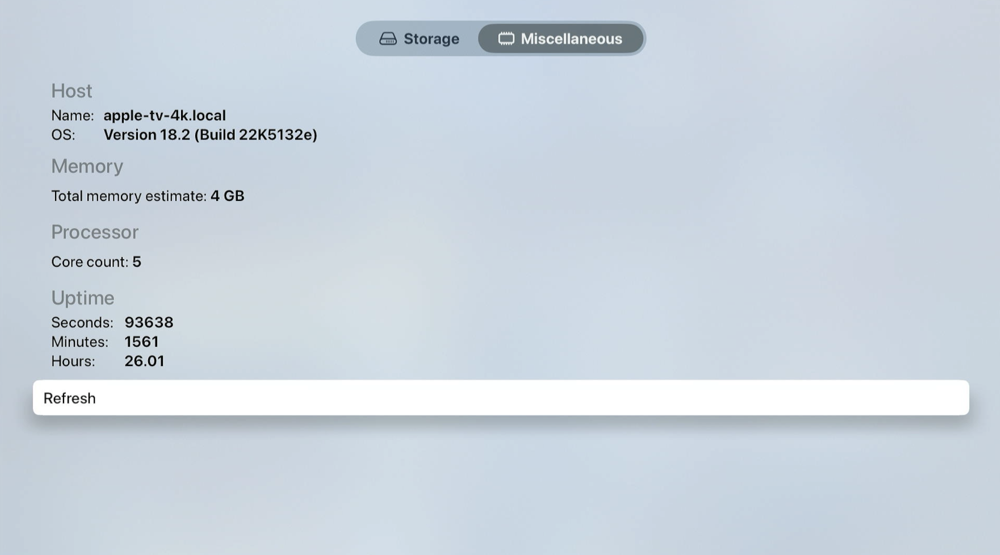

# ATVSpecs
SwiftUI tvOS app for viewing device information.

## Information
- This personal project is a way to view system information on an Apple TV.
- Makes use of ProcessInfo and other functions to get information on storage, processor, memory, and more.

## Examples

## Usage
Open the project in Xcode and run with either a Simulator running tvOS (will display information from your Mac if simulated) or a physical Apple TV as a destination.

This is a personal project for learning Swift and SwiftUI. Feel free to fork, explore, and make the project your own for any personal use!

## Other Projects
- **iOS BrushTimer** https://github.com/zhrispineda/BrushTimer
- **iOS Settings** https://github.com/zhrispineda/Settings-iOS
